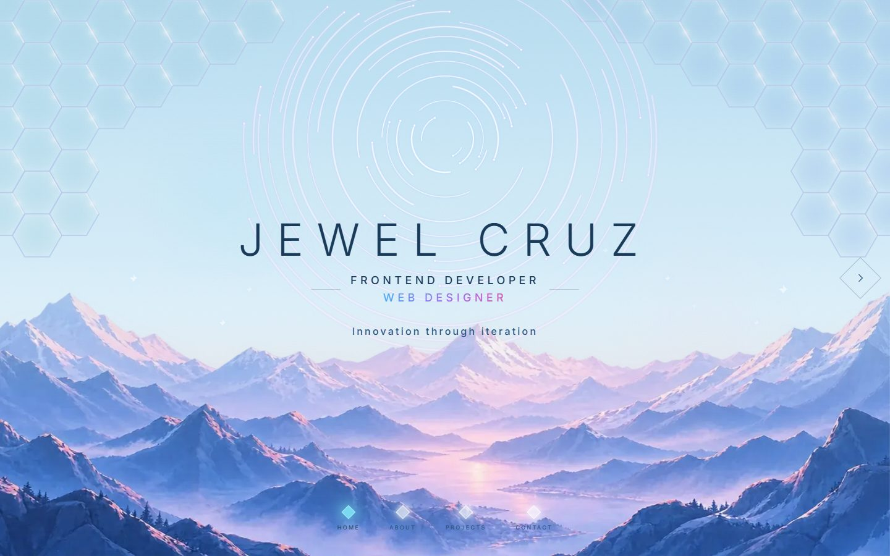
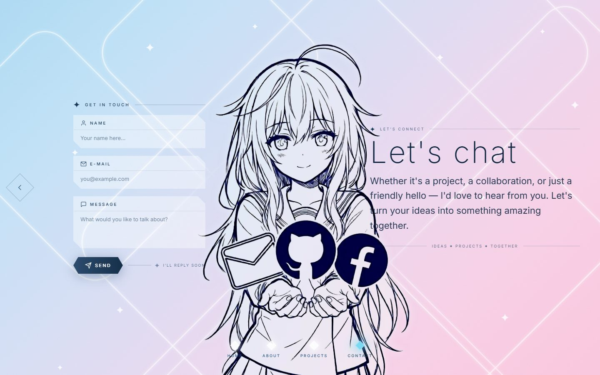
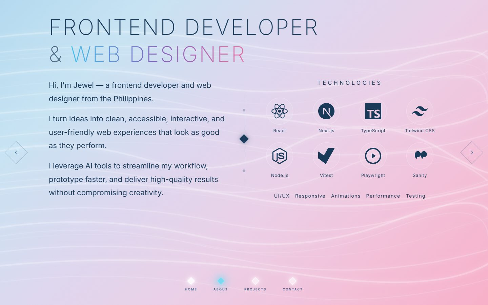
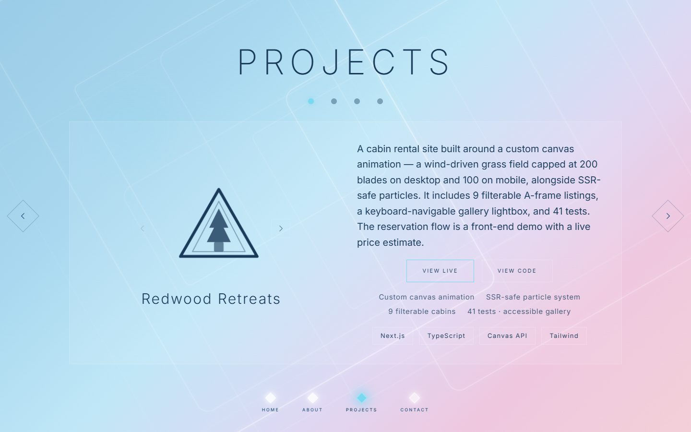

# Jewel Cruz — Portfolio

[](https://portfolio-flame-eta-50.vercel.app)
[](#lighthouse-production-build-mobile)
[](LICENSE)
[](./public/resume.pdf)

Personal portfolio for **Jewel Cruz**, a frontend developer and web designer. A single-page, slide-based experience with a custom canvas background, built to be fast, accessible, and almost entirely static.

**Live:** https://portfolio-flame-eta-50.vercel.app

**Resume:** [one-page PDF](./public/resume.pdf) — also served at `/resume.pdf` on the live site



## A look around

Four slides, navigable by keyboard (`←` / `→`), swipe, or the arrow buttons.

| About                                                                       | Projects                                                                   |
| --------------------------------------------------------------------------- | -------------------------------------------------------------------------- |
|                  |  |
| <sub><b>About</b> — bio, technology grid, working style</sub>               | <sub><b>Projects</b> — live link, source link, stack and highlights</sub>  |



<sub><b>Contact</b> — validated form posting straight to Web3Forms, with no third-party script loaded</sub>

## Lighthouse (production build, mobile)

```
Performance 100 · Accessibility 100 · Best Practices 100 · SEO 100
```

## Highlights

- **Custom canvas background** — a hexagon grid plus animated star trails, drawn with the Canvas API. Drawing is skipped on inactive slides, throttled on touch devices, and fully disabled under `prefers-reduced-motion`.
- **Slide navigation** by keyboard (`←` / `→`), touch swipe, arrow buttons, and a bottom indicator.
- **Contact form** with client-side validation that submits directly to Web3Forms from the browser (`api.web3forms.com` is the only allowed cross-origin `connect-src`). No third-party script is loaded.
- **Email link** opens Gmail's compose window on desktop, and falls back to a plain `mailto:` on touch devices.
- **Optimized hero** — the background image goes through `next/image` with a responsive `srcset` and a preload, instead of shipping one oversized file to every viewport.
- **No ads, no analytics, no third-party scripts.**

## Stack

| Layer | Choice |
| --- | --- |
| Framework | Next.js 16 (App Router, Turbopack) |
| UI | React 19 |
| Language | TypeScript (strict) |
| Styling | Tailwind CSS v4 |
| Graphics | Canvas API + inline SVG |
| Tests | Node's built-in test runner |

## Architecture

- `src/app/page.tsx` — slide orchestration and per-slide decorative layers
- `src/components/` — one component per file. `Hero`, `TechIcon`, `About`, and `Footer` are **server components**; the rest are client components
- `src/lib/site.ts` — single source of truth for contact, project data, and the theme color
- `src/lib/validate.ts` — contact-form validation shared by the form and its tests
- `src/lib/site-url.ts` — canonical origin resolution shared by metadata, `robots.ts` and `sitemap.ts`
- `src/app/robots.ts` / `src/app/sitemap.ts` — generated from the canonical origin so they cannot drift from the metadata

## Notable decisions

- **Static-first.** Every route prerenders, including `robots.txt` and `sitemap.xml`.
- **Server components where they fit.** Four of the eight components ship no client JavaScript.
- **Validation, client side.** The form validates with tests, then posts straight to Web3Forms. The access key is public by design; lock it to this domain in the Web3Forms dashboard.
- **Design tokens.** All colors, gradients, glows, and shadows live in `globals.css`; components reference them with `var(--token)`.

## Getting started

```bash
npm install
npm run dev      # http://localhost:3000
npm test         # run the test suite
npm run lint     # eslint
npm run typecheck
npm run build    # production build
npm start        # serve the production build
```

## Environment

```bash
NEXT_PUBLIC_SITE_URL=   # canonical site URL (falls back to the Vercel URL, then the production alias)
```

## Structure

```
src/
├── app/
│   ├── layout.tsx        # metadata, fonts, JSON-LD
│   ├── page.tsx          # slide orchestration
│   ├── globals.css       # theme tokens and animations
│   ├── manifest.ts
│   ├── not-found.tsx
│   ├── robots.ts
│   └── sitemap.ts
├── components/           # hero, about, projects, contact, footer, canvas, background, tech-icon
└── lib/                  # site data, validation, site URL
```

## License

MIT
